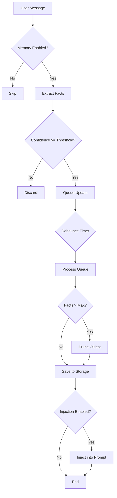

DeerFlow's memory system enables agents to remember user preferences, context, and conversation history across sessions. The system automatically extracts, stores, and injects relevant facts into agent prompts.

## Overview

The memory system provides:

<CardGroup cols={2}>
  <Card title="Fact Extraction" icon="brain">
    Automatically extracts key facts from conversations using LLM analysis
  </Card>
  <Card title="Persistent Storage" icon="database">
    Stores facts in JSON format with confidence scores and timestamps
  </Card>
  <Card title="Context Injection" icon="syringe">
    Intelligently injects relevant facts into agent system prompts
  </Card>
  <Card title="Debounced Updates" icon="clock">
    Batches updates to reduce LLM calls and improve performance
  </Card>
</CardGroup>

## Configuration

Memory is configured in the `memory` section of `config.yaml`:

```yaml config.yaml
memory:
  enabled: true
  storage_path: memory.json
  debounce_seconds: 30
  model_name: null
  max_facts: 100
  fact_confidence_threshold: 0.7
  injection_enabled: true
  max_injection_tokens: 2000
```

## Configuration Options

<ParamField path="enabled" type="boolean" default="true">
  Whether to enable the memory system globally.
  
  Set to `false` to disable memory extraction and injection.
</ParamField>

<ParamField path="storage_path" type="string" default="memory.json">
  Path to store memory data.
  
  **Path Resolution:**
  - Empty string (`""`) → `{DEER_FLOW_HOME}/memory.json` (default)
  - Relative path → `{DEER_FLOW_HOME}/{storage_path}`
  - Absolute path → Used as-is
  
  Where `DEER_FLOW_HOME` is:
  1. `DEER_FLOW_HOME` environment variable, or
  2. `.deer-flow/` in backend directory (dev mode), or
  3. `~/.deer-flow/` (default)
</ParamField>

<Info>
  **Migration Note**: If you previously set `storage_path: .deer-flow/memory.json`, it will now resolve to `{DEER_FLOW_HOME}/.deer-flow/memory.json`. Use an absolute path to preserve the old location.
</Info>

<ParamField path="debounce_seconds" type="integer" default="30" min="1" max="300">
  Seconds to wait before processing queued memory updates.
  
  **How it works:**
  - Memory updates are queued during conversation
  - After `debounce_seconds` of inactivity, updates are batched and processed
  - Reduces LLM calls and API costs
  
  **Tuning:**
  - Lower values (10-30s) → More frequent updates, higher costs
  - Higher values (60-300s) → Less frequent updates, lower costs
</ParamField>

<ParamField path="model_name" type="string" default="null">
  Model to use for memory extraction and updates.
  
  - `null` → Uses the default model (first in `models` list)
  - Specify model name → Uses that configured model
  
  **Recommendation**: Use a lightweight, cost-effective model like `gpt-4o-mini` for memory operations.
</ParamField>

<ParamField path="max_facts" type="integer" default="100" min="10" max="500">
  Maximum number of facts to store in memory.
  
  When the limit is reached:
  - Oldest facts (by timestamp) are removed first
  - Or lowest confidence facts if timestamps are equal
</ParamField>

<ParamField path="fact_confidence_threshold" type="float" default="0.7" min="0.0" max="1.0">
  Minimum confidence score (0.0-1.0) required to store a fact.
  
  Facts with confidence below this threshold are discarded.
  
  **Tuning:**
  - Higher values (0.8-1.0) → Only high-confidence facts stored
  - Lower values (0.5-0.7) → More facts stored, potentially less accurate
</ParamField>

<ParamField path="injection_enabled" type="boolean" default="true">
  Whether to inject memory facts into agent system prompts.
  
  Set to `false` to store facts without injecting them (passive mode).
</ParamField>

<ParamField path="max_injection_tokens" type="integer" default="2000" min="100" max="8000">
  Maximum tokens to use for memory injection in system prompts.
  
  Facts are prioritized by confidence and recency, then truncated to fit this limit.
  
  **Tuning:**
  - Lower values (500-1000) → Only highest priority facts injected
  - Higher values (2000-4000) → More comprehensive context
</ParamField>

## Storage Format

Memory is stored as JSON with the following structure:

```json memory.json
{
  "facts": [
    {
      "content": "User prefers Python over JavaScript for backend development",
      "confidence": 0.95,
      "timestamp": "2026-03-04T10:30:00Z",
      "source": "conversation"
    },
    {
      "content": "User's primary tech stack is React, FastAPI, and PostgreSQL",
      "confidence": 0.88,
      "timestamp": "2026-03-04T10:32:15Z",
      "source": "conversation"
    },
    {
      "content": "User works on a project called 'DeerFlow'",
      "confidence": 1.0,
      "timestamp": "2026-03-04T10:35:42Z",
      "source": "conversation"
    }
  ],
  "metadata": {
    "last_updated": "2026-03-04T10:35:42Z",
    "total_facts": 3,
    "version": "1.0"
  }
}
```

### Fact Fields

- **content**: The extracted fact as a natural language statement
- **confidence**: Confidence score (0.0-1.0) assigned by the LLM
- **timestamp**: ISO 8601 timestamp when the fact was extracted
- **source**: Source of the fact (typically `"conversation"`)

## How Memory Works

<Steps>
  <Step title="Conversation Analysis">
    As the user interacts with the agent, conversation messages are analyzed for extractable facts.
  </Step>
  
  <Step title="Fact Extraction">
    The memory system uses an LLM to extract key facts:
    - User preferences and habits
    - Project information
    - Technical context
    - Personal details (when relevant)
  </Step>
  
  <Step title="Confidence Scoring">
    Each extracted fact is assigned a confidence score:
    - **0.9-1.0**: Explicit statements ("I prefer X")
    - **0.7-0.9**: Strong inference ("I always use X")
    - **0.5-0.7**: Weak inference ("I might use X")
    - **Below 0.5**: Discarded (below threshold)
  </Step>
  
  <Step title="Debounced Storage">
    Facts are queued and stored after `debounce_seconds` of inactivity to batch updates.
  </Step>
  
  <Step title="Fact Pruning">
    If `max_facts` is exceeded:
    - Sort facts by timestamp (oldest first)
    - Remove oldest facts until within limit
    - Optionally consider confidence scores
  </Step>
  
  <Step title="Context Injection">
    When `injection_enabled` is `true`:
    - Top facts (by confidence and recency) are selected
    - Facts are formatted and injected into the system prompt
    - Injection is truncated to `max_injection_tokens`
  </Step>
</Steps>

## Memory Injection Format

When memory is injected into the agent's system prompt:

```
## User Context

Based on previous interactions, here's what I know about you:

- You prefer Python over JavaScript for backend development
- Your primary tech stack is React, FastAPI, and PostgreSQL
- You work on a project called 'DeerFlow'
- You prefer detailed, technical explanations

I'll use this context to provide more personalized and relevant assistance.
```

<Info>
  The exact injection format is determined by the agent's prompt template. The above is an example.
</Info>

## Configuration Examples

### Minimal Memory (Cost-Optimized)

For minimal API usage:

```yaml
memory:
  enabled: true
  debounce_seconds: 120  # 2 minutes - less frequent updates
  max_facts: 50          # Fewer facts stored
  fact_confidence_threshold: 0.8  # Only high-confidence facts
  max_injection_tokens: 1000  # Smaller context injection
```

### Comprehensive Memory

For maximum context retention:

```yaml
memory:
  enabled: true
  debounce_seconds: 30   # Frequent updates
  max_facts: 500         # Many facts stored
  fact_confidence_threshold: 0.6  # Lower threshold
  max_injection_tokens: 4000  # Large context injection
```

### Memory Without Injection

Store facts but don't inject them (for analysis only):

```yaml
memory:
  enabled: true
  storage_path: memory.json
  injection_enabled: false  # Facts stored but not injected
  debounce_seconds: 60
```

### Custom Storage Location

```yaml
memory:
  enabled: true
  storage_path: /var/lib/deerflow/memory.json  # Absolute path
```

### Per-User Memory

For multi-tenant setups, use environment variables:

```yaml
memory:
  enabled: true
  storage_path: $DEER_FLOW_HOME/users/${USER_ID}/memory.json
```

## Programmatic Access

Access memory configuration in Python:

```python
from src.config.memory_config import get_memory_config

config = get_memory_config()

if config.enabled:
    print(f"Memory enabled: {config.enabled}")
    print(f"Storage path: {config.storage_path}")
    print(f"Max facts: {config.max_facts}")
    print(f"Confidence threshold: {config.fact_confidence_threshold}")
    print(f"Injection enabled: {config.injection_enabled}")
```

### Update Configuration at Runtime

```python
from src.config.memory_config import get_memory_config, set_memory_config, MemoryConfig

# Get current config
config = get_memory_config()

# Modify and update
config.debounce_seconds = 60
config.max_facts = 200
set_memory_config(config)
```

## Best Practices

<AccordionGroup>
  <Accordion title="Use a Lightweight Model" icon="feather">
    Memory operations don't need powerful models. Use a cost-effective model:
    
    ```yaml
    models:
      - name: gpt-4o-mini  # Fast and cheap
        # ...
    
    memory:
      model_name: gpt-4o-mini  # Use for memory operations
    ```
  </Accordion>
  
  <Accordion title="Tune Debounce for Your Use Case" icon="clock">
    - **Interactive applications**: 30-60 seconds
    - **Long-running tasks**: 120-300 seconds
    - **Cost-sensitive**: Higher values
  </Accordion>
  
  <Accordion title="Set Appropriate Fact Limits" icon="list">
    - **Personal assistant**: 100-200 facts
    - **Project-specific agent**: 200-500 facts
    - **Multi-user system**: Separate memory files per user
  </Accordion>
  
  <Accordion title="Monitor Storage Size" icon="database">
    Regularly check memory file size:
    
    ```bash
    ls -lh ~/.deer-flow/memory.json
    ```
    
    If too large, reduce `max_facts` or increase `fact_confidence_threshold`.
  </Accordion>
  
  <Accordion title="Backup Memory Data" icon="floppy-disk">
    Memory files contain valuable context. Back them up regularly:
    
    ```bash
    cp ~/.deer-flow/memory.json ~/.deer-flow/memory.backup.json
    ```
  </Accordion>
</AccordionGroup>

## Memory Lifecycle



## Troubleshooting

<AccordionGroup>
  <Accordion title="Memory not persisting" icon="triangle-exclamation">
    Check storage path and permissions:
    
    ```bash
    # Verify path exists
    ls -la ~/.deer-flow/
    
    # Check file permissions
    ls -l ~/.deer-flow/memory.json
    
    # Ensure writable
    chmod 644 ~/.deer-flow/memory.json
    ```
  </Accordion>
  
  <Accordion title="Too many/few facts extracted" icon="triangle-exclamation">
    Adjust `fact_confidence_threshold`:
    
    ```yaml
    memory:
      fact_confidence_threshold: 0.8  # Increase for fewer facts
      # OR
      fact_confidence_threshold: 0.6  # Decrease for more facts
    ```
  </Accordion>
  
  <Accordion title="Memory updates too frequent/infrequent" icon="triangle-exclamation">
    Tune `debounce_seconds`:
    
    ```yaml
    memory:
      debounce_seconds: 60   # Increase for less frequent updates
      # OR
      debounce_seconds: 15   # Decrease for more frequent updates
    ```
  </Accordion>
  
  <Accordion title="Context injection too large" icon="triangle-exclamation">
    Reduce `max_injection_tokens`:
    
    ```yaml
    memory:
      max_injection_tokens: 1000  # Smaller injection
    ```
  </Accordion>
</AccordionGroup>

## Next Steps

<CardGroup cols={2}>
  <Card title="Environment Variables" icon="code" href="/configuration/environment-variables">
    Configure environment variables
  </Card>
  <Card title="Agent Customization" icon="robot" href="/guides/customizing-agents">
    Customize agent behavior
  </Card>
</CardGroup>