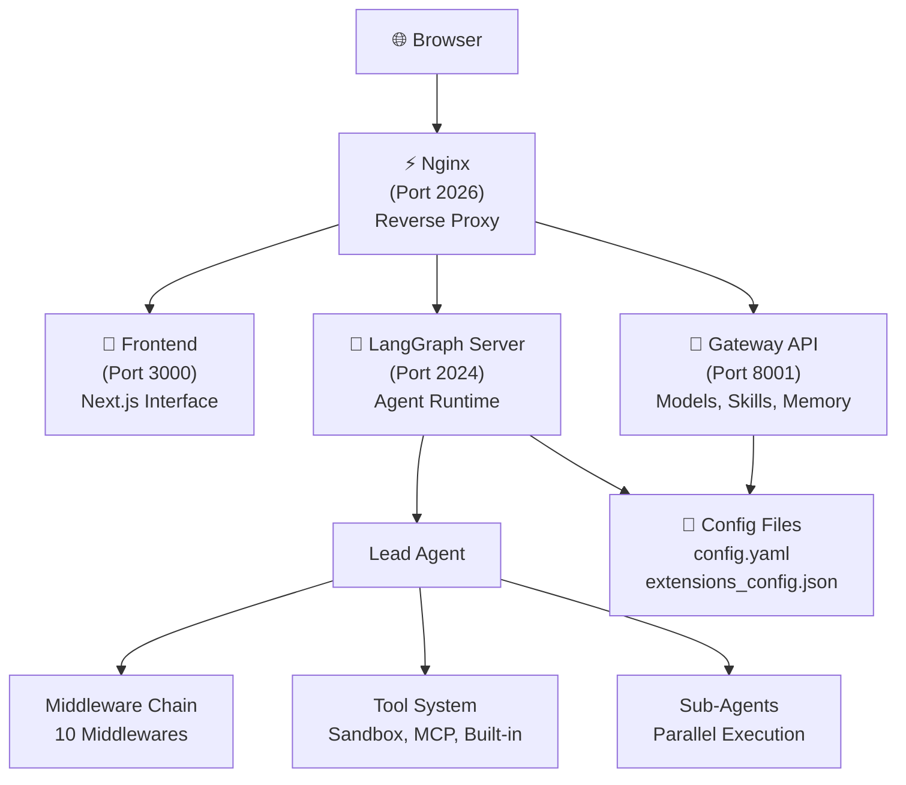

# Welcome to DeerFlow

DeerFlow (**D**eep **E**xploration and **E**fficient **R**esearch **Flow**) is an open-source **super agent harness** that orchestrates **sub-agents**, **memory**, and **sandboxes** to do almost anything — powered by **extensible skills**.

<Note>
**DeerFlow 2.0** is a ground-up rewrite built on LangGraph and LangChain. It shares no code with v1, which is maintained on the [`1.x` branch](https://github.com/bytedance/deer-flow/tree/main-1.x).
</Note>

## What is DeerFlow?

DeerFlow started as a Deep Research framework — but developers pushed it far beyond research. They've used it to build data pipelines, generate slide decks, spin up dashboards, and automate complex workflows. Things we never anticipated.

DeerFlow 2.0 is no longer just a framework you wire together. **It's a super agent harness** — batteries included, fully extensible. It ships with everything an agent needs out of the box:

- **Isolated sandbox environments** with full filesystem access
- **Persistent memory** that learns your preferences and context
- **Extensible skills** for specialized workflows
- **Sub-agent orchestration** for complex, multi-step tasks
- **Tool ecosystem** including web search, file operations, and bash execution

<Info>
Use it as-is for immediate productivity, or tear it apart and make it yours.
</Info>

## Core Capabilities

<CardGroup cols={2}>
  <Card title="Agent Orchestration" icon="diagram-project">
    Lead agent delegates complex tasks to specialized sub-agents that run in parallel, each with scoped context and tools
  </Card>
  
  <Card title="Sandbox Execution" icon="box">
    Each task runs in an isolated environment with full filesystem, bash access, and code execution — all auditable and sandboxed
  </Card>
  
  <Card title="Extensible Skills" icon="puzzle-piece">
    Structured capability modules for research, report generation, slide creation, web pages, and more — or add your own
  </Card>
  
  <Card title="Persistent Memory" icon="brain">
    Long-term memory across sessions that learns your profile, preferences, and workflows — stored locally under your control
  </Card>
</CardGroup>

## Architecture Overview

DeerFlow is built on a modern, scalable architecture:



### System Components

<AccordionGroup>
  <Accordion title="LangGraph Server (Port 2024)" icon="robot">
    The core agent runtime built on LangGraph for robust multi-agent workflow orchestration.
    
    **Responsibilities:**
    - Agent creation and configuration
    - Thread state management with checkpointing
    - Middleware chain execution (10 middlewares)
    - Tool execution orchestration
    - SSE streaming for real-time responses
    
    **Entry Point:** `src/agents/lead_agent/agent.py:make_lead_agent`
  </Accordion>
  
  <Accordion title="Gateway API (Port 8001)" icon="plug">
    FastAPI REST application for non-agent operations and configuration management.
    
    **Endpoints:**
    - `/api/models` - List and configure LLM models
    - `/api/mcp` - Manage MCP (Model Context Protocol) servers
    - `/api/skills` - Skill discovery, installation, and management
    - `/api/memory` - Memory system access and configuration
    - `/api/threads/{id}/uploads` - File upload with document conversion
    - `/api/threads/{id}/artifacts` - Serve generated artifacts
  </Accordion>
  
  <Accordion title="Frontend (Port 3000)" icon="browser">
    Next.js web application providing an intuitive chat interface.
    
    **Features:**
    - Real-time streaming chat with SSE
    - File upload and management
    - Artifact preview and download
    - Model and skill configuration
    - Memory inspection
  </Accordion>
  
  <Accordion title="Nginx (Port 2026)" icon="layer-group">
    Unified reverse proxy entry point that routes traffic:
    
    - `/api/langgraph/*` → LangGraph Server
    - `/api/*` (other) → Gateway API
    - `/*` (non-API) → Frontend
  </Accordion>
</AccordionGroup>

## Key Features Deep Dive

### Skills & Tools

Skills are what make DeerFlow do *almost anything*.

A skill is a structured capability module — a Markdown file (`SKILL.md`) that defines a workflow, best practices, and references to supporting resources. DeerFlow ships with built-in skills for:

- **Research** - Deep web research with source verification
- **Report Generation** - Structured document creation
- **Slide Creation** - Presentation generation
- **Web Pages** - HTML/CSS site building
- **Image & Video Generation** - Media creation workflows

**Skills are loaded progressively** — only when the task needs them, keeping the context window lean.

<CodeGroup>
```bash Skills Directory Structure
skills/
├── public/                    # Public skills (committed)
│   ├── research/SKILL.md
│   ├── report-generation/SKILL.md
│   ├── slide-creation/SKILL.md
│   ├── web-page/SKILL.md
│   └── image-generation/SKILL.md
└── custom/                    # Custom skills (gitignored)
    └── your-custom-skill/SKILL.md
```

```yaml SKILL.md Format
---
name: PDF Processing
description: Handle PDF documents efficiently
license: MIT
allowed-tools:
  - read_file
  - write_file
  - bash
---

# Skill Instructions

This content is injected into the agent's system prompt when the skill is activated...
```
</CodeGroup>

### Sub-Agents

Complex tasks rarely fit in a single pass. DeerFlow decomposes them.

The lead agent spawns **sub-agents on the fly** — each with its own scoped context, tools, and termination conditions. Sub-agents run in parallel when possible, report back structured results, and the lead agent synthesizes everything into a coherent output.

<Tip>
**Concurrency:** Up to 3 sub-agents can run simultaneously, with a 15-minute timeout per agent.
</Tip>

**Built-in Sub-Agent Types:**
- `general-purpose` - Full toolset for complex multi-step tasks
- `bash` - Command execution specialist

This is how DeerFlow handles tasks that take minutes to hours: a research task might fan out into a dozen sub-agents, each exploring a different angle, then converge into a single report — or a website — or a slide deck with generated visuals.

### Sandbox & File System

DeerFlow doesn't just *talk* about doing things. **It has its own computer.**

Each task runs inside an isolated environment with a full filesystem:

```bash Virtual Filesystem (Agent's View)
/mnt/user-data/
├── uploads/          # Your uploaded files
├── workspace/        # Agent's working directory
└── outputs/          # Final deliverables

/mnt/skills/          # Skills directory
├── public/
└── custom/
```

**Physical Mapping:**
```bash Host Filesystem
backend/.deer-flow/threads/{thread_id}/
├── user-data/
│   ├── uploads/
│   ├── workspace/
│   └── outputs/

skills/
├── public/
└── custom/
```

The agent reads, writes, edits files, executes bash commands, and views images. **All sandboxed, all auditable, zero contamination between sessions.**

<Warning>
DeerFlow supports two sandbox modes:
- **Local** (development): Direct execution on host machine
- **Docker** (production): Isolated container execution
</Warning>

### Context Engineering

DeerFlow manages context aggressively to stay sharp across long tasks:

<Steps>
  <Step title="Isolated Sub-Agent Context">
    Each sub-agent runs in its own isolated context, unable to see the main agent or other sub-agents. This ensures focus on the task at hand.
  </Step>
  
  <Step title="Automatic Summarization">
    Within a session, DeerFlow summarizes completed sub-tasks when approaching token limits, compressing what's no longer immediately relevant.
  </Step>
  
  <Step title="Filesystem Offloading">
    Intermediate results are offloaded to the filesystem, keeping the context window lean.
  </Step>
</Steps>

### Long-Term Memory

Most agents forget everything when a conversation ends. **DeerFlow remembers.**

Across sessions, DeerFlow builds a persistent memory of:
- Your profile and work context
- Preferences and behaviors
- Accumulated knowledge and facts
- Recurring workflows and patterns

**Memory Structure:**
```json
{
  "userContext": {
    "workContext": "Senior engineer at tech startup",
    "personalContext": "Prefers Python and TypeScript",
    "topOfMind": "Working on LangGraph documentation"
  },
  "facts": [
    {
      "id": "fact_1",
      "content": "Prefers concise code comments",
      "category": "preference",
      "confidence": 0.95,
      "source": "conversation on 2026-03-01"
    }
  ]
}
```

Memory is stored locally in `backend/.deer-flow/memory.json` and stays under your control. The more you use DeerFlow, the better it knows you.

## Recommended Models

DeerFlow is **model-agnostic** — it works with any LLM that implements the OpenAI-compatible API. That said, it performs best with models that support:

<CardGroup cols={2}>
  <Card title="Long Context" icon="arrows-left-right">
    100k+ token windows for deep research and multi-step tasks
  </Card>
  
  <Card title="Reasoning" icon="brain">
    Adaptive planning and complex task decomposition capabilities
  </Card>
  
  <Card title="Multimodal" icon="images">
    Image understanding and video comprehension support
  </Card>
  
  <Card title="Strong Tool Use" icon="wrench">
    Reliable function calling and structured output generation
  </Card>
</CardGroup>

**Supported Providers:**
- OpenAI (GPT-4, GPT-4o)
- Anthropic (Claude 3.5 Sonnet)
- Google (Gemini 2.5 Pro)
- DeepSeek (V3 with thinking support)
- Volcengine (Doubao-Seed-1.8)
- Any OpenAI-compatible API (Novita AI, Kimi, etc.)

## What's Next?

<CardGroup cols={2}>
  <Card title="Quick Start" icon="rocket" href="/quickstart">
    Get DeerFlow running in minutes with our step-by-step guide
  </Card>
  
  <Card title="Configuration" icon="gear" href="/configuration">
    Learn how to configure models, tools, and skills
  </Card>
  
  <Card title="Architecture" icon="diagram-project" href="/architecture">
    Deep dive into DeerFlow's technical architecture
  </Card>
  
  <Card title="API Reference" icon="book" href="/api">
    Complete API documentation for Gateway and LangGraph
  </Card>
</CardGroup>
